# คู่มือการติดตั้ง Ubuntu Desktop 24.04 LTS

คู่มือฉบับนี้อ้างอิงจากบทช่วยสอนการติดตั้ง Ubuntu อย่างเป็นทางการ ครอบคลุมขั้นตอนตั้งแต่การบูตระบบไปจนถึงการติดตั้งเสร็จสมบูรณ์

---

## 1. การบูตจากแฟลชไดรฟ์ USB (Boot from USB flash drive)
1. เสียบแฟลชไดรฟ์ USB เข้ากับแล็ปท็อปหรือพีซีที่คุณต้องการใช้ติดตั้ง Ubuntu และทำการเปิดเครื่องหรือรีสตาร์ท 
2. ระบบควรจะตรวจพบสื่อการติดตั้งโดยอัตโนมัติ หากไม่เป็นเช่นนั้น ให้ลองกดปุ่ม **F12** (หรือ Escape, F2, F10 ขึ้นอยู่กับระบบ) ค้างไว้ระหว่างเริ่มบูต เพื่อเลือกอุปกรณ์ USB จากเมนูการบูต
3. เมื่อตัวติดตั้งเริ่มต้นทำงาน คุณจะได้รับแจ้งให้เลือก **ภาษา (Language)**

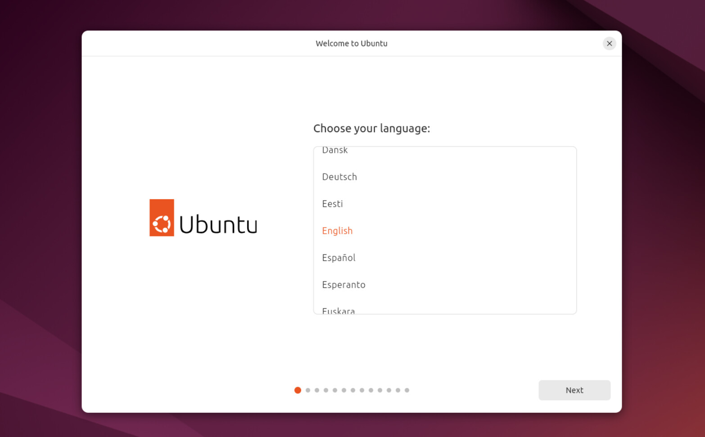

4. จากนั้นจะเข้าสู่หน้าตัวเลือกเพื่อตั้งค่า **การเข้าถึง (Accessibility settings)** ตามที่คุณต้องการ

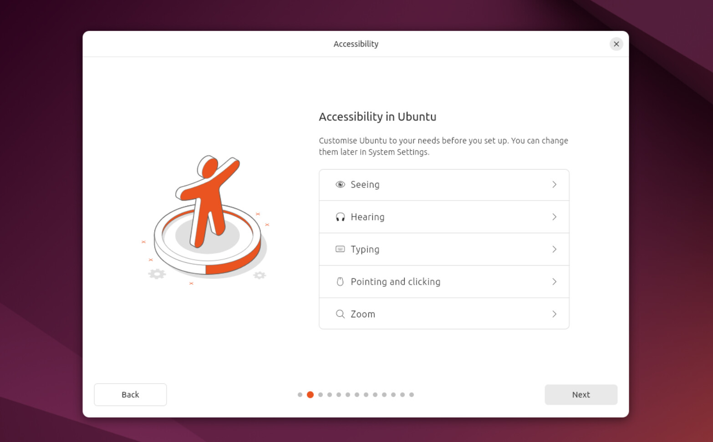

5. เลือก **เค้าโครงแป้นพิมพ์ (Keyboard layout)**

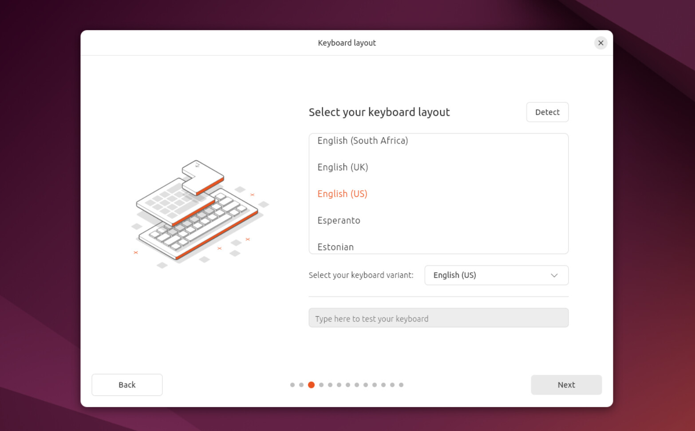

6. ถัดมาเป็นการตั้งค่า **การเชื่อมต่อเครือข่าย (Network)** แนะนำให้เชื่อมต่ออินเทอร์เน็ต เพื่อให้ระบบสามารถดาวน์โหลดการอัปเดตและไดรเวอร์ของบุคคลที่สาม (เช่น ไดรเวอร์กราฟิก NVIDIA) ระหว่างการติดตั้งได้

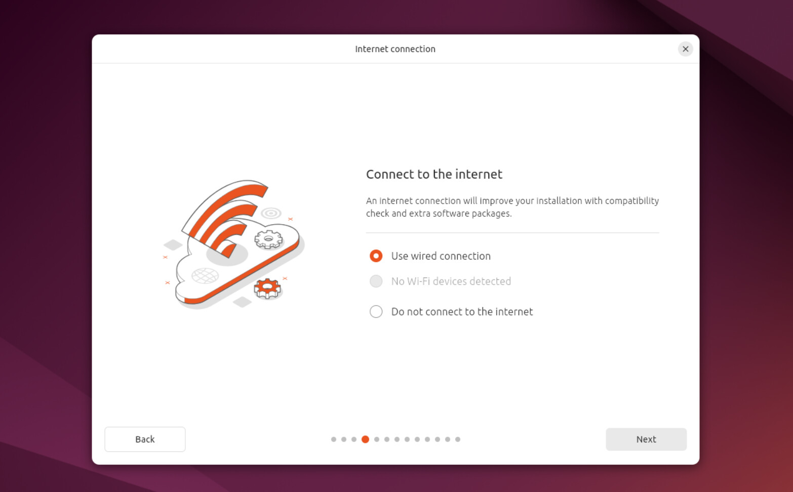

7. หลังจากนั้นจะมีตัวเลือกให้เลือกระหว่าง **"ทดลองใช้ (Try Ubuntu)"** หรือ **"ติดตั้ง (Install Ubuntu)"**

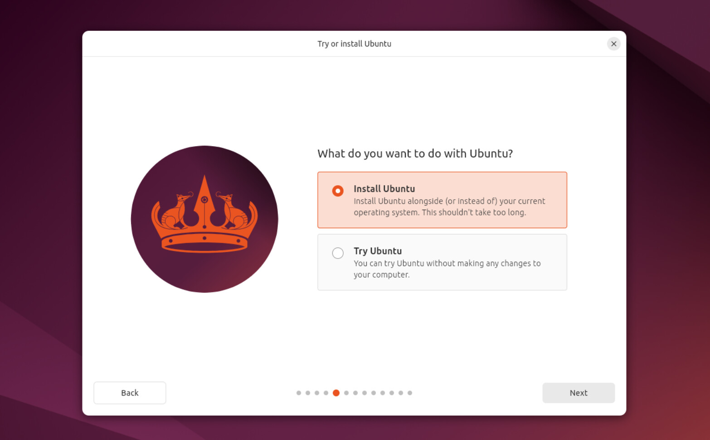

   - **Try Ubuntu:** ทดลองใช้งาน Ubuntu ได้โดยไม่ต้องทำการเปลี่ยนแปลงใด ๆ กับพีซี คุณสามารถติดตั้งภายหลังได้โดยคลิกที่ไอคอน "Install Ubuntu" บนเดสก์ท็อป
   - **Install Ubuntu:** คลิกที่นี่เพื่อดำเนินการติดตั้งต่อไป

*(หมายเหตุ: หากพีซีของคุณใช้ระบบ Intel RST อาจมีปปัญหาระหว่างติดตั้ง คุณจำเป็นต้องปิด RST ในเมนู BIOS ก่อนถึงจะสามารถดำเนินการต่อได้)*

---

## 2. การตั้งค่าการติดตั้ง (Installation setup)
1. เลือกระหว่างการติดตั้งแบบโต้ตอบ (**Interactive installation**) หรือแบบอัตโนมัติ (**Automated Installation**) สำหรับผู้ใช้งานทั่วไปให้เลือกการติดตั้งแบบโต้ตอบเป็นหลัก

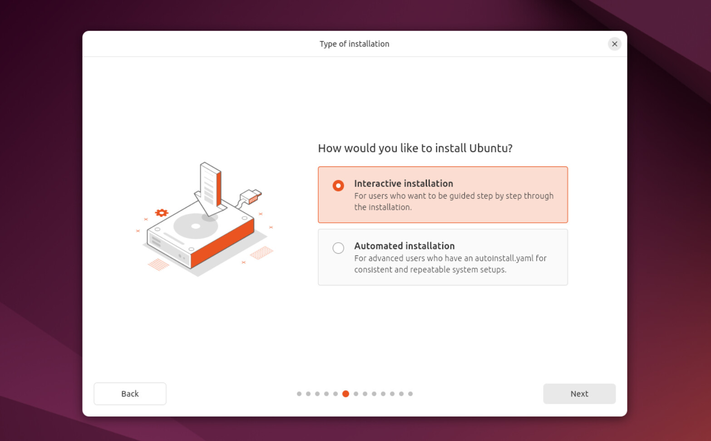

2. ถัดมา ให้เลือกระหว่าง **Default selection** (ติดตั้งเฉพาะเครื่องมือพื้นฐานเพื่อเริ่มต้นใช้งาน) และ **Extended selection** (รวมเครื่องมือเพิ่มเติม เช่น ชุดออฟฟิศและเครื่องมืออำนวยความสะดวก ซึ่งเหมาะสำหรับการใช้งานแบบออฟไลน์)

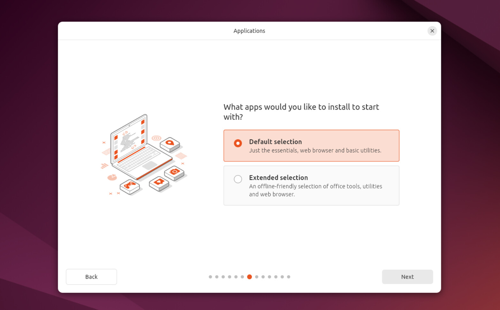

3. ในหน้าจอถัดไป ระบบจะเสนอให้ติดตั้งซอฟต์แวร์จากบุคคลที่สามเพื่อเพิ่มประสิทธิภาพการรองรับอุปกรณ์ (เช่น ไดรเวอร์ NVIDIA) และรองรับรูปแบบสื่อเพิ่มเติม ขอแนะนำให้ทำเครื่องหมายเลือกทั้งสองช่องนี้

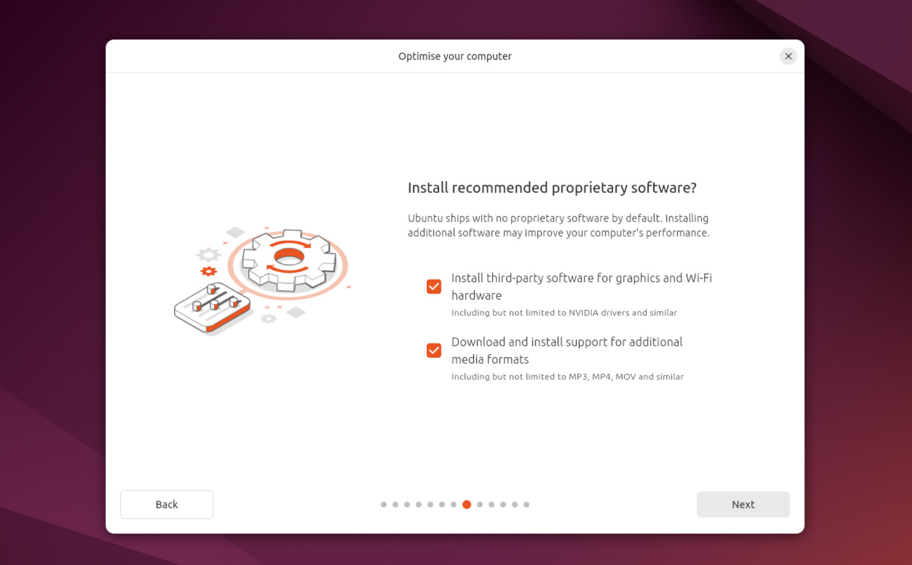

---

## 3. ประเภทของการติดตั้ง (Type of installation)
หน้านี้ให้คุณกำหนดค่าฮาร์ดไดรฟ์สำหรับการติดตั้งของคุณ:
- **ติดตั้ง Ubuntu ควบคู่ไปกับระบบปฏิบัติการอื่น (Install Ubuntu alongside...):** หากอุปกรณ์ของคุณมี OS อื่น (เช่น Windows) ติดตั้งอยู่แล้ว คุณสามารถเลือกติดตั้ง Ubuntu ควบคู่ไปได้ ระบบจะมีแถบเลื่อนให้คุณแบ่งสัดส่วนพื้นที่ดิสก์โดยไม่ทำให้ข้อมูลเก่าสูญหาย

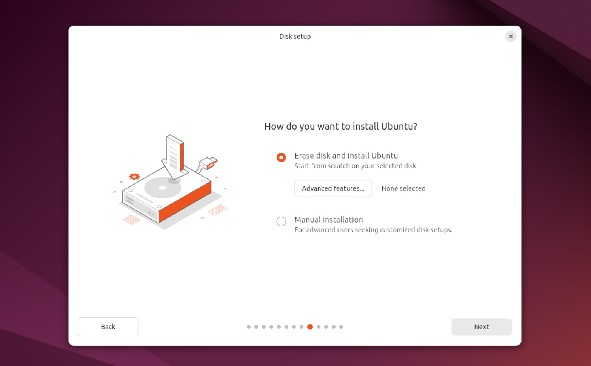

- **ลบดิสก์และติดตั้ง Ubuntu (Erase disk and install Ubuntu):** หากต้องการให้ Ubuntu เป็นระบบปฏิบัติการเดียวในเครื่อง ระบบจะใช้พื้นที่ทั้งหมดของไดรฟ์
  - *Advanced features:* คุณสามารถเปิดใช้การเข้ารหัสไดรฟ์เต็มรูปแบบผ่าน LVM, ZFS หรือ TPM ได้ (หากเลือกเข้ารหัส LVM หรือ ZFS จะต้องตั้ง Security key ซึ่งคุณห้ามทำหายโดยเด็ดขาด!)
- **การแบ่งพาร์ติชันด้วยตนเอง (Manual partitioning):** สำหรับผู้ใช้ขั้นสูงที่ต้องการจัดการพาร์ติชันของดิสก์ด้วยตัวเอง

*(ข้อควรระวัง: หากอุปกรณ์เปิดใช้งาน Windows BitLocker อยู่ คุณอาจต้องเข้าไปปิด BitLocker ใน Windows ก่อน เพื่อให้ตัวติดตั้ง Ubuntu สามารถจัดการกับไดรฟ์ได้อย่างปลอดภัย)*

---

## 4. สร้างรายละเอียดการเข้าสู่ระบบของคุณ (Create Your Login Details)
- ป้อนชื่อของคุณ (Name) และชื่อคอมพิวเตอร์ (Computer's name) ซึ่งจะเป็นชื่อที่ปรากฏในเครือข่าย
- สร้างชื่อผู้ใช้ (Username) และ รหัสผ่านที่รัดกุม (Password)
- คุณสามารถเลือกได้ว่าจะให้เข้าสู่ระบบอัตโนมัติ (Log in automatically) หรือ ต้องระบุรหัสผ่านเพื่อเข้าสู่ระบบ (Require my password to log in) ขอแนะนำให้เลือกต้องใช้รหัสผ่านเพื่อความปลอดภัยของข้อมูล

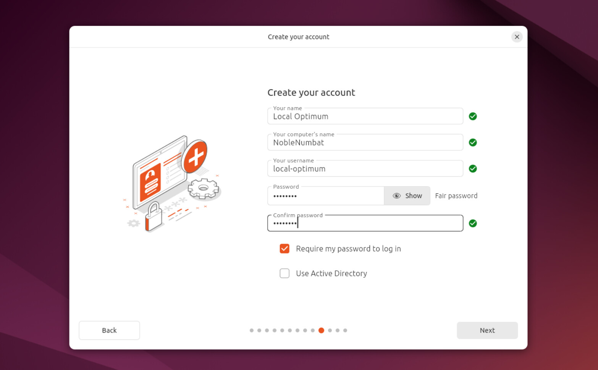

---

## 5. เลือกตำแหน่งของคุณ (Choose your Location)
- เลือกตำแหน่งที่ตั้งและเขตเวลา (Timezone) ของคุณจากแผนที่แล้วคลิก **Continue** หากคุณเชื่อมต่ออินเทอร์เน็ตอยู่แล้ว ระบบมักจะตรวจจับตำแหน่งให้โดยอัตโนมัติ

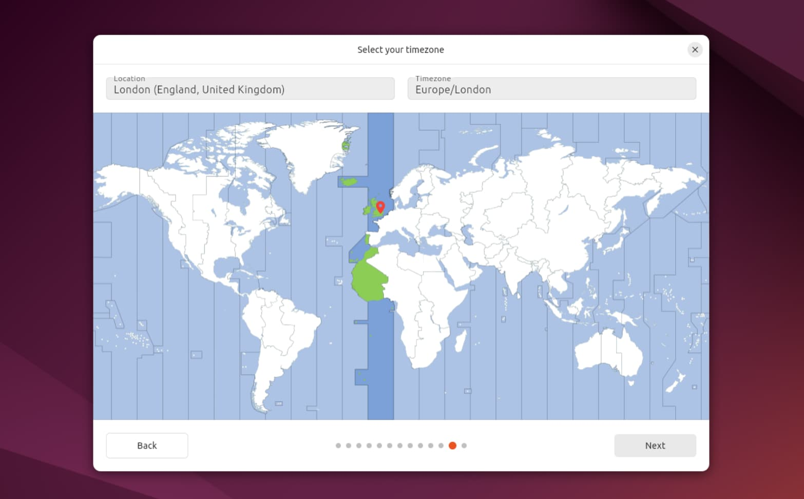

---

## 6. พร้อมสำหรับการติดตั้ง (Ready to install)
- หน้าจอนี้จะสรุปการกำหนดค่าการติดตั้งทั้งหมดให้คุณทราบ 
- ตรวจสอบความถูกต้องของข้อมูลทั้งหมดอีกครั้ง แล้วคลิก **Install** เพื่อเริ่มต้นติดตั้งระบบปฏิบัติการ

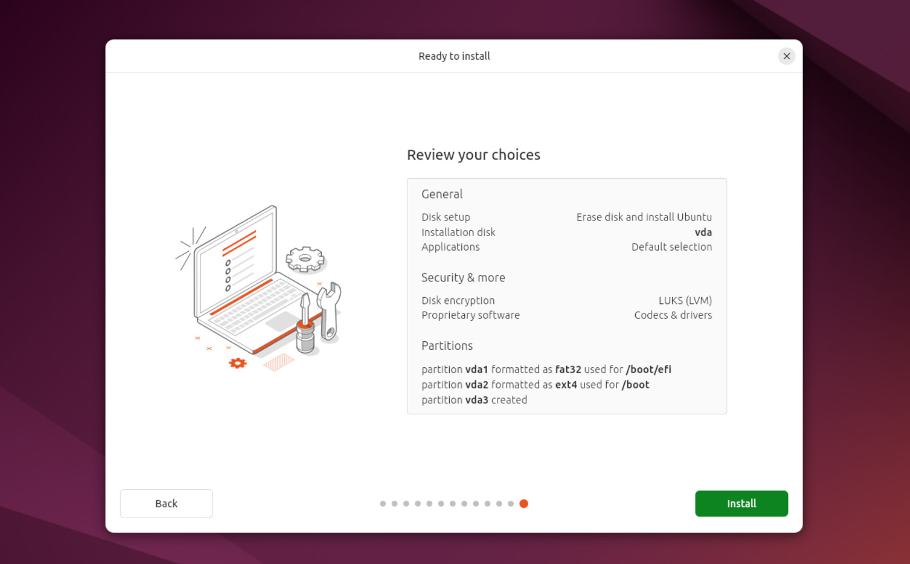

---

## 7. เสร็จสิ้นการติดตั้ง (Complete the Installation)
1. นั่งรอและชมสไลด์โชว์แนะนำระบบ หรือคลิกที่ไอคอนมุมล่างขวาเพื่อดูรายละเอียดเบื้องหลังระหว่างที่ Ubuntu กำลังติดตั้ง

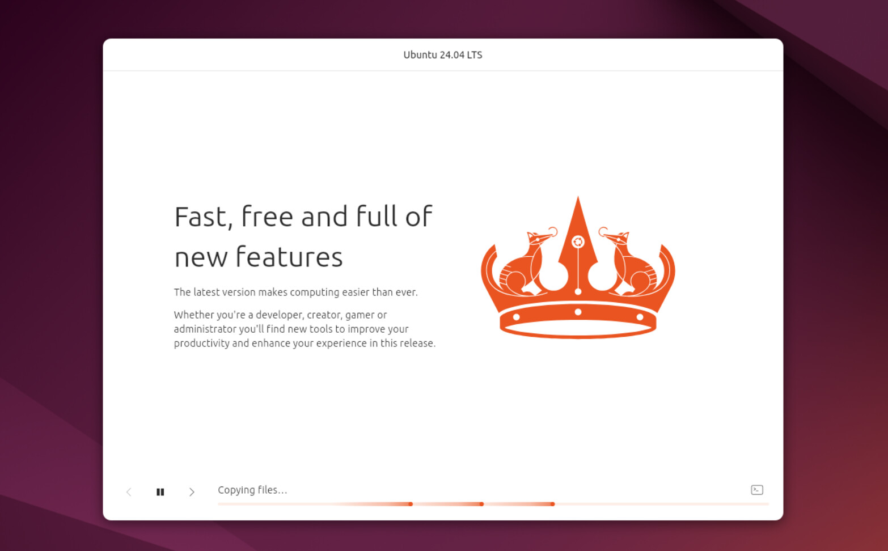

2. เมื่อการติดตั้งเสร็จสมบูรณ์ จะมีข้อความปรากฏขึ้นให้คุณรีสตาร์ทเครื่อง ให้คลิก **Restart Now**

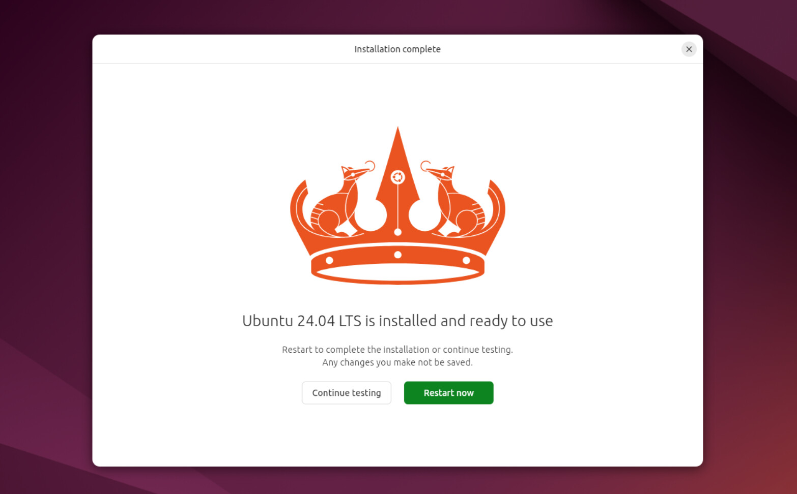

3. ระหว่างการรีสตาร์ท ระบบจะแจ้งให้คุณถอดแฟลชไดรฟ์ USB ออก เมื่อถอดแล้วให้กดปุ่ม **ENTER**

4. (หากคุณตั้งค่าการเข้ารหัสฮาร์ดดิสก์ไว้ ให้กรอกรหัสผ่านเพื่อปลดล็อกดิสก์)

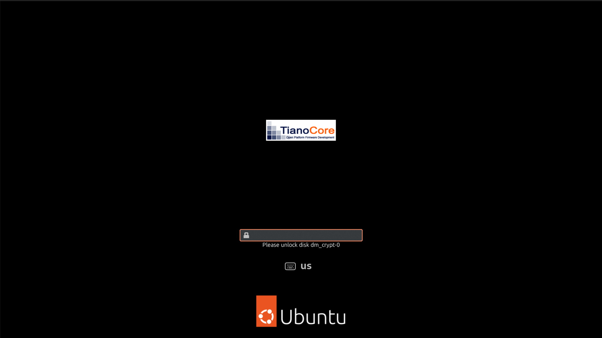

5. เมื่อเข้าสู่หน้าจอเข้าสู่ระบบ (Login screen) ให้กรอก Username และ Password ที่คุณตั้งไว้

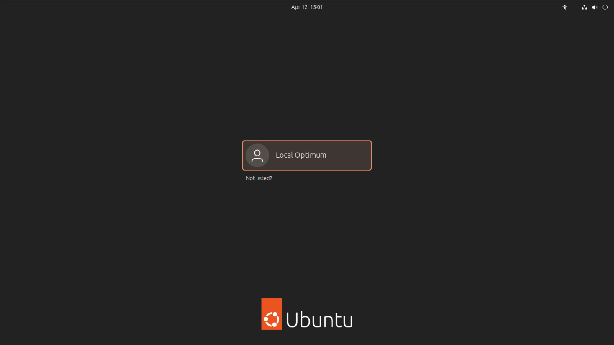

6. ยินดีต้อนรับสู่ Ubuntu Desktop ใหม่ของคุณ! คุณจะพบกับหน้าต่างการตั้งค่าเริ่มต้น (Welcome widget)

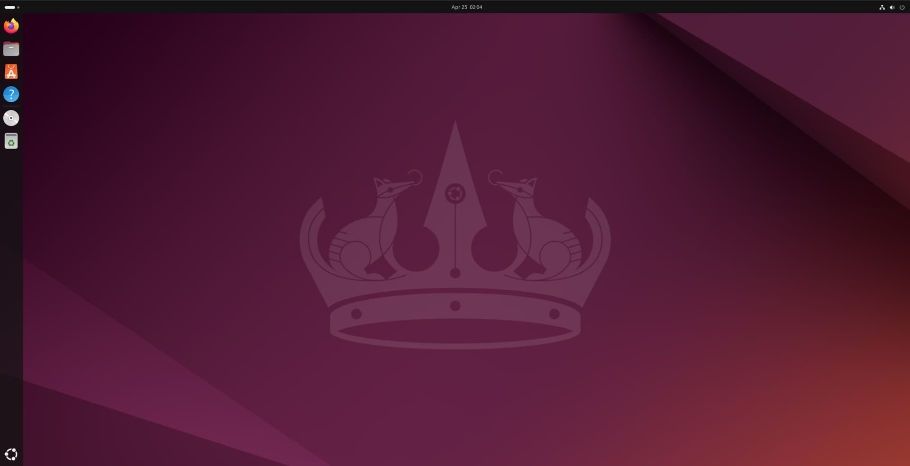

10. ซึ่งสามารถตั้งค่าเพิ่มเติมได้ เช่น เชื่อมต่อกับ Ubuntu Pro, การตั้งค่าความเป็นส่วนตัว, และการเตรียมดาวน์โหลดแอปพลิเคชันเพิ่มเติม

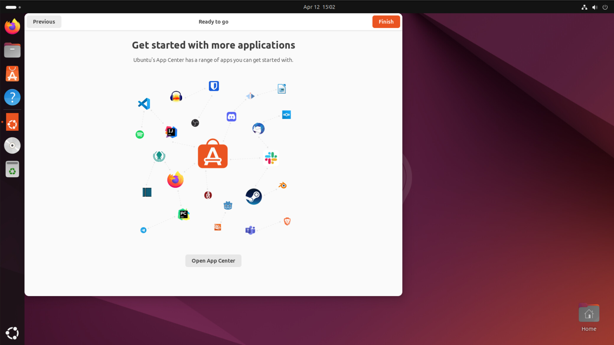

---
*หมายเหตุ: คู่มือนี้จัดทำขึ้นจากบทช่วยสอนในเว็บไซต์ทางการของ Ubuntu*
